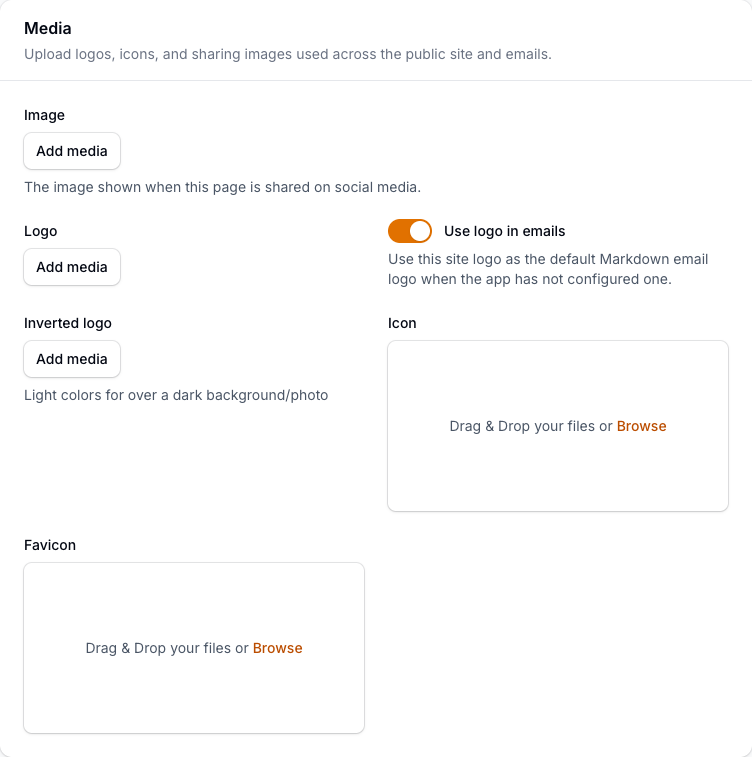
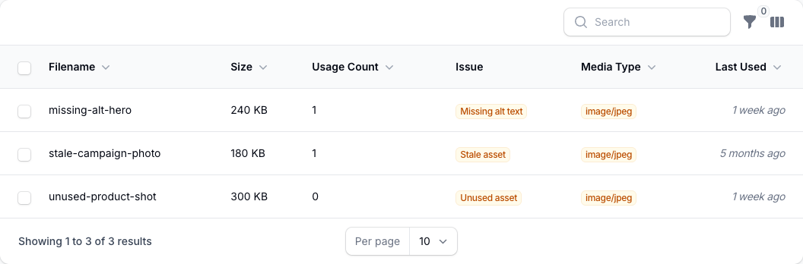

# Using Media Library

This guide is for editors who manage images and files and owners deciding how to keep the library tidy. Every step uses the labels you see on screen.

## Using Media Library (editor how-to)

### How to upload and organise media

1. Go to **Media Library**.
2. Upload your images or files.
3. Put them into a folder so they are easy to find later.
4. Repeat for any related files you want grouped together.

### How to add alt text to an image

1. Open the image in the library.
2. Fill in its **alt text**: a short description of what the image shows.
3. Save. Alt text helps visitors who use screen readers and improves search.

### How to find media instead of re-uploading

1. In **Media Library**, use search to look for the file by name.
2. If it already exists, reuse it rather than uploading a copy.

### How to replace a file

1. Open the media item.
2. Replace its file with a new version.
3. Save. Pages that use it pick up the new file.

### How to pick media while editing a page

1. While editing a page or widget, click an image field.
2. The **media picker** opens.
3. Choose an existing image, or upload a new one, then save the page.

### How to review media health

1. Open the **Media health** page.
2. Read the summary at the top to see how many assets are stale, missing, or incomplete.
3. Work through the list and fix what is flagged, such as adding alt text or replacing a missing file.

### How to fix flagged media

1. On the **Media health** page, scan the rows for items that need attention.
2. Each row shows what is wrong and its remediation state.
3. Open a flagged item, fix it, and the row clears once the issue is resolved.

## Rolling out Media Library (for owners)

### Turn on first

- **A simple folder structure and an alt-text habit.** Agree where things go and that every image gets alt text before the library grows large.

### Add when needed

| Need                            | Enable                                  |
| ------------------------------- | --------------------------------------- |
| Keep a growing library findable | More folders, named by topic or section |
| Better accessibility and SEO    | Alt text on every image                 |

### Don't enable yet

- Don't over-organise on day one. Start with a few clear folders and split them as the library grows.

### Who does what

| Role       | First useful screen                                     |
| ---------- | ------------------------------------------------------- |
| Editor     | **Media Library**: upload, organise, and add alt text   |
| Site owner | **Media Library**: review folder hygiene and duplicates |

## Troubleshooting for editors

| What you see                             | What it means                                   | What to do                                                      |
| ---------------------------------------- | ----------------------------------------------- | --------------------------------------------------------------- |
| I have two copies of the same image      | A duplicate was uploaded instead of reused      | Search before uploading; delete the copy you don't need         |
| An image looks wrong after I replaced it | The page is showing a cached version            | Wait a moment, or ask whoever manages caching to clear the page |
| A screen reader skips my image           | It has no alt text                              | Open the image and add **alt text**                             |
| I can't find an image I uploaded         | It is in a different folder, or named unclearly | Search by name, or rename it so it is easier to find            |
