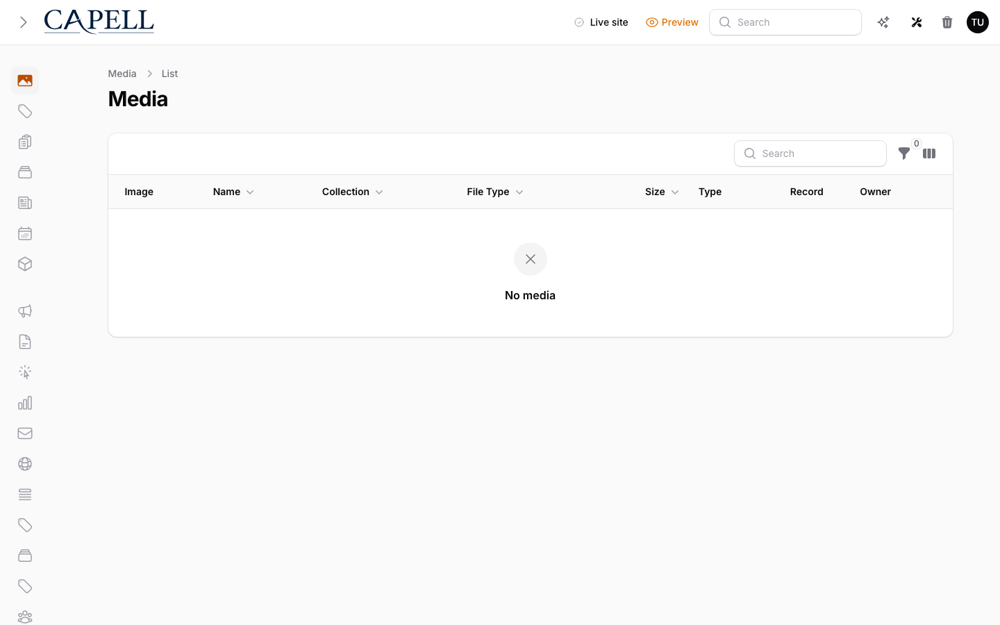

# Media Library

Status: **Available, no schema impact in this package** · Kind: **package** · Tier: **free** · Bundle: **foundation** · Contexts: **admin** · Product group: **Capell Foundation**

This page is the consolidated implementation overview for the Media Library package. It is extracted from the package README, service providers, migrations, config files, routes, resources, models, actions, and the shared Capell ERD notes where available.

## What This Package Adds

Media Library connects Capell to Awcodes Curator media, focal point and responsive metadata, media health reporting, rights metadata checks, duplicate and orphan cleanup reports, usage reports, and Spatie Media migration support.

- Curator media model wrapper.
- Media health admin page and table.
- Curator media field factory.
- Focal point, crop preset, responsive variant, rights metadata, duplicate, usage, and orphan media helpers.
- Migration command and action for moving Spatie media into Curator.
- InteractsWithCuratorMedia concern.
- Configurable upload validation for mime types, extensions, and max file size.
- Media health issue labels for missing alt text, stale assets, and unused assets.

## Developer Notes

Centralises Curator integration behind actions, field factories, and model concerns so packages can use media fields consistently.

- MediaLibraryServiceProvider registers the package.
- Model: CuratorMedia.
- Command: MigrateSpatieToCuratorCommand.
- Action: MigrateSpatieMediaToCuratorAction.
- Page: MediaHealthPage.
- No migrations are present in this package.

## Operational Notes

Helps site operators audit media records and move legacy media into the current Capell media foundation.

- Adds Curator media field integration.
- Adds media health admin page. The stale threshold is configured with `capell.media_library.stale_after_days`.
- Adds publishable `media-library-config`; `capell.media_library.owner_foreign_keys` accepts a list of `['table' => string, 'column' => string]` pairs that reference Curator media.
- Adds migration command.
- No package-owned database changes.

## Data And Retention

- This package does not define its own migrations.
- It relies on Curator and existing media tables.
- Migration result data records counts and outcomes for Spatie-to-Curator moves.

## Screenshot Plan

- Media health page.
- Media health table.
- Curator media field inside a form.
- Migration command output or report.

## Screenshots

The package currently resolves each media screenshot to the same media table. Add separate screenshots only after there are distinct seeded health, migration, and form-field states to capture.

## Pitfalls

- Install and migrate Curator before relying on CuratorMedia.
- Configure `capell.media_library.owner_foreign_keys` before relying on usage or orphan cleanup reports.
- Configure `capell.media_library.allowed_mime_types`, `allowed_extensions`, and `max_upload_kb` before exposing uploads to editors.
- Back up legacy Spatie media before migration.
- Check disk paths and conversions before bulk migration.

## Verification

- Run `vendor/bin/pest packages/media-library/tests` when package tests exist.
- Run the relevant host-app migration or package install flow in a disposable database.
- Open the listed admin or frontend surface and compare it with the screenshot plan.

## Package Manifest

- Composer name: `capell-app/media-library`
- Product group: Capell Foundation
- Kind: package
- Tier: free
- Bundle: foundation
- Contexts: `admin`
- Requires: `capell-app/core`, `capell-app/admin`
- Optional dependencies: None listed.

## Admin Surfaces

- MediaHealthPage (packages/media-library/src/Filament/Pages/MediaHealthPage.php, slug `media-health`)

## Commands

- None proven in this package directory.

## Routes And Config

- Config: `packages/media-library/config/media-library.php`, merged under `capell.media_library` and publishable with the `media-library-config` tag.
- Owner media references: `owner_foreign_keys` is a list of table/column pairs, for example `['table' => 'pages', 'column' => 'hero_image_id']`. The health and orphan query actions validate configured tables and columns against the live schema before composing usage-count SQL.

## Permissions And Gates

- Gate: MediaHealthPage: Filament Shield page permissions

## Migrations

- None proven in this package directory.

## ERD Excerpt

This package has no committed ERD excerpt. Use implementation notes and extension points instead of inventing schema.

## Screenshot Automation

Deployment should read [screenshots.json](screenshots.json), install the package with demo data, resolve each admin surface or frontend URL, and write images to `packages/media-library/docs/screenshots`.

- Media health page.
- Media health table.
- Curator media field inside a form.
- Migration command output or report.
